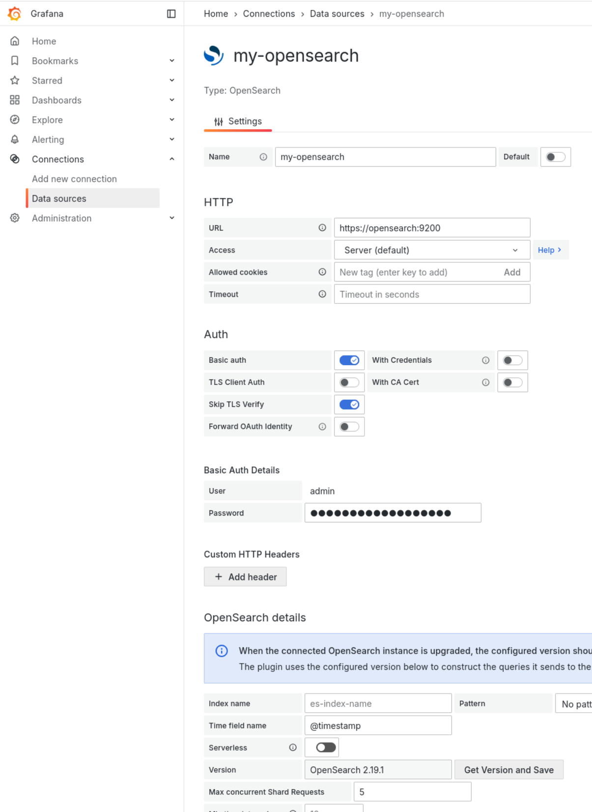

# Monitoring Play Ground
Here, a `Docker` stack is provided for testing out commonly used monitoring toolsets.
Docker can be installed with a [convenience script](https://docs.docker.com/engine/install/fedora/#install-using-the-convenience-script):
- `$ curl -fsSL https://get.docker.com -o get-docker.sh`
- `$ sudo sh get-docker.sh `

## Setup
### Prerequisites
I recommend `Docker` for simplicity. `Podman` should work as well but was not tested and my need some adaptions, as podman compose does not work to well...

### Steps
1) **OPTIONAL**: Uncomment the InfluxDB services in `docker-compose.yml`, if required
2) Fill `.env`. **NOTE: OpenSearch requires a save PW! Check `$ sudo docker compose logs` for details!**
3) `$ source .env`
4) Create data dir `$ mkdir -m 777 -p ./DB/OS`
5) Make sure that log dir is writable: `$ chmod 777 -R ./logs`
6) Temporarily disable SELinux, if problems occur: `$ sudo setenforce 0`
7) `$ sudo docker compose up -d` and wait some time
8) Check `$ docker compose logs` and `./logs/grafana.log` for details

## Access the Services
- OpenSearch: read/write via API on port 9200 
- Dashboards: http://localhost:5601
- InfluxDB: http://localhost:8086
- Grafana: http://localhost:3000

## Fill the OpenSearch with Example Data
1) Login to http://localhost:5601
2) Add sample data, e.g.: `Sample flight data`
3) Explore the Dashboards as well as the Index in `Discover` and later on in `Index Management -> Indexes`.

## Connect the Services
For details go to [http://localhost:3000/connections/datasources/grafana-opensearch-datasource](http://localhost:3000/connections/datasources/grafana-opensearch-datasource)
1) Install opensearch-plugin: `$ grafana-cli plugins install grafana-opensearch-datasource` (deprecated soon, see [LINK](https://grafana.com/grafana/plugins/grafana-opensearch-datasource/?tab=installation)!) 
2) Login to Grafana: http://localhost:3000
3) `Connections -> Data Sources -> Add data source -> opensearch`
4) Fill in as indicated on the screenshot

5) Play around and create your own dashboards and alerts
6) It is possible to add different data sources to grafana to build complex dashboards
